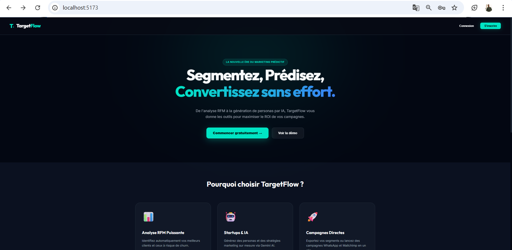
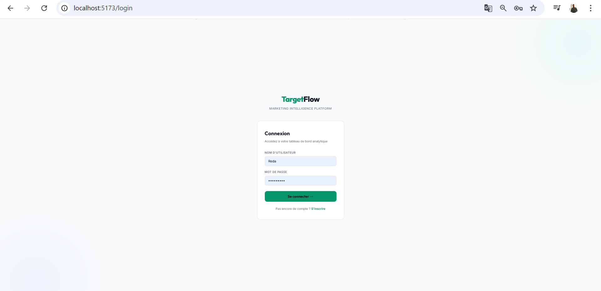
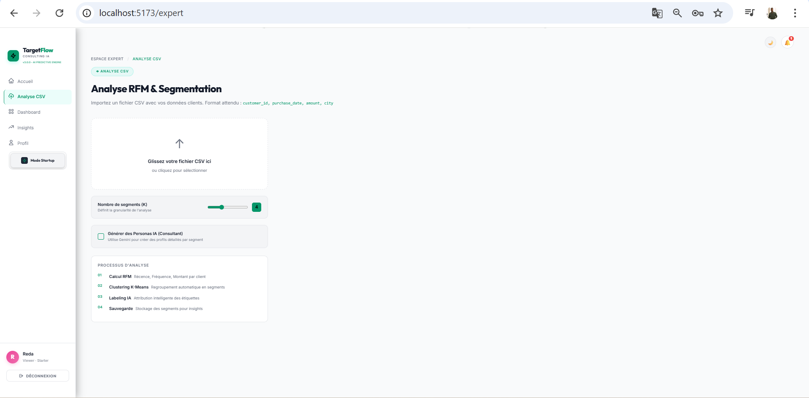
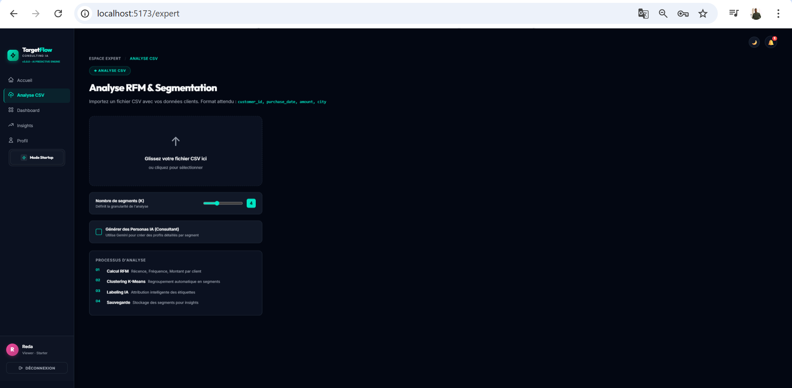
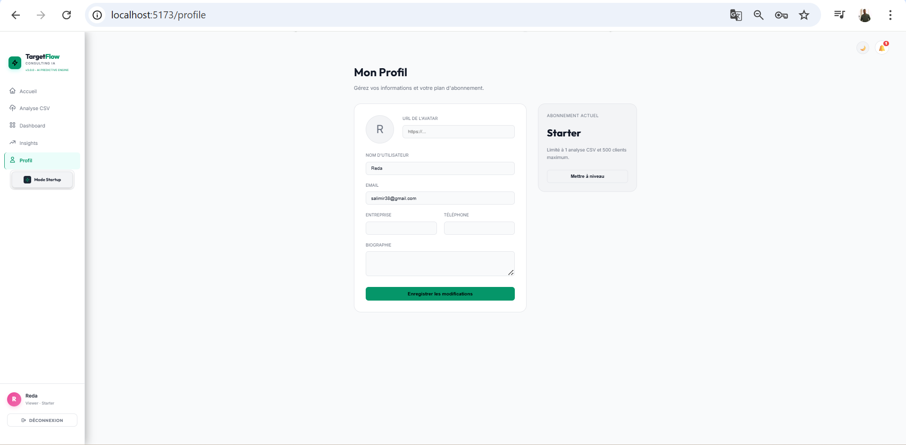
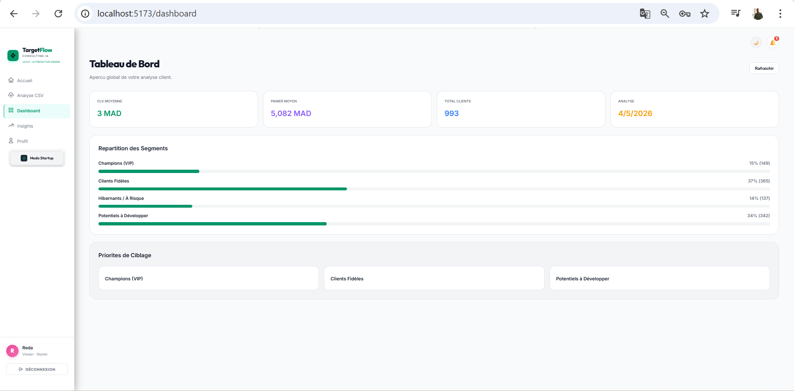
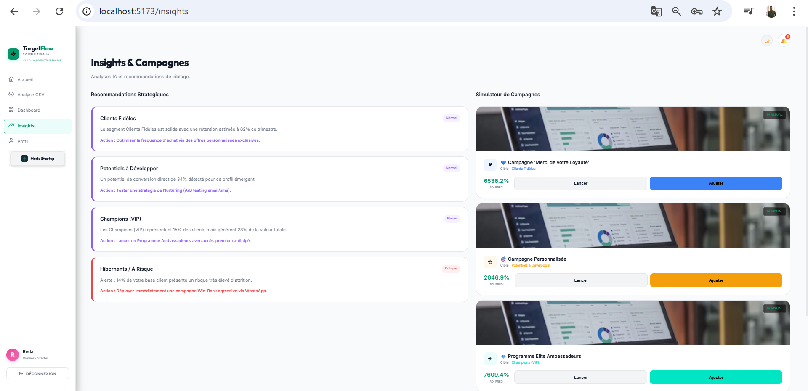

# 🚀 TargetFlow – AI-Powered Marketing Segmentation Platform

TargetFlow is an intelligent full-stack web application designed to automate customer segmentation, marketing targeting, and decision-making using Data Science and Artificial Intelligence.

Built specifically with the Moroccan market in mind, TargetFlow helps startups and marketing experts transform raw customer data into actionable insights in just a few clicks.

---

## 🧠 Problem & Vision

In today’s digital world, businesses generate massive amounts of customer data. However, most marketers lack the technical expertise to analyze and extract value from this data.

👉 TargetFlow solves this problem by:
- Automating customer segmentation
- Simplifying data analysis
- Providing AI-powered recommendations
- Making data-driven marketing accessible to everyone

---

## 🎯 Project Objectives

- Democratize Data Analytics for non-technical users  
- Enable one-click customer segmentation from CSV files  
- Assist marketing decision-making with AI insights  
- Provide a modern and intuitive dashboard  

---

## ✨ Core Features

### 📥 Data Import & Processing
- Upload customer transaction data (CSV)  
- Automatic validation and preprocessing  
- Fast processing using Python & Pandas  

### 📊 Customer Segmentation (ML)
- RFM Analysis (Recency, Frequency, Monetary)  
- K-Means Clustering (Scikit-learn)  
- Automatic segment labeling (High Value, Loyal, At Risk…)  

### 📈 KPI Dashboard
- Customer Lifetime Value (CLV)  
- Average spending  
- Segment distribution  
- Real-time analytics  

### 🗺️ Geographic Analytics
- Customer distribution by Moroccan cities (Casablanca, Rabat, Marrakech…)  
- Regional classification (North / Center / South / East / Sahara)  
- Heatmap visualization  

### 🤖 AI-Powered Insights
- Integration with Google Gemini  
- Automatic generation of:
  - Marketing insights  
  - Customer personas  
  - Campaign suggestions  

### 🔔 Notifications System
- Real-time updates  
- User-specific alerts  
- Analysis tracking  

### 👥 User Modes

#### 🧑‍💼 Expert Mode
- Full control over analysis  
- Upload datasets  
- Advanced segmentation tools  

#### 🚀 Startup Mode
- Guided experience  
- Simplified insights  
- Ready-to-use recommendations  

---

## 🏗️ System Architecture

### 🔹 Frontend
- React.js (Vite)  
- Responsive UI (Light/Dark Mode)  
- Hosted on Vercel  

### 🔹 Backend
- Django + Django REST Framework  
- RESTful API

### 🔹 AI Layer
- Google Gemini API  
- Machine Learning (Scikit-learn)  

### 🔹 Database
- SQLite

---

## 🛠️ Technologies Used

- Python (Django, Pandas)  
- React.js  
- Scikit-learn (K-Means)  
- Google Gemini AI  
- JWT Authentication  
- REST APIs  

---

## ⚙️ Installation Guide

### 🔹 Backend

git clone https://github.com/redasalimi/targetflow.git  
cd targetflow-backend  

python -m venv venv  
venv\Scripts\activate  

pip install -r requirements.txt  

python manage.py migrate  
python manage.py runserver  

---

### 🔹 Frontend

cd targetflow-frontend  

npm install  
npm run dev  

---

## 🔑 Environment Variables

Create a `.env` file:

SECRET_KEY=your_secret_key  
DEBUG=True  
DATABASE_URL=your_database_url  
GEMINI_API_KEY=your_api_key  

---

## 📡 API Endpoints

| Endpoint | Description |
|----------|------------|
| /analysis/dashboard/ | KPIs and analytics |
| /analysis/notifications/ | Notifications |
| /analysis/... | Segmentation APIs |

---

## 📸 Screenshots

### 🏠 Home Page

### 🔐 Authentication

### 🧑‍💼 Expert Mode

### 🧑‍💼 Expert Mode (Dark mode)

### 🚀 Startup Mode

### 📊 Dashboard

### 🤖 Insights

---

## 🚧 Limitations

- Data quality depends on CSV structure
- Requires structured input data
- Limited real-time integrations

---

## 🔮 Future Improvements

- Real-time integrations (Shopify, WooCommerce)
- Automated campaigns (WhatsApp, Mailchimp)
- Advanced ML models (Churn Prediction)
- More advanced dashboards

---

## 👨‍💻 Author

Reda Salimi  

GitHub: https://github.com/redasalimi  
LinkedIn: https://www.linkedin.com/in/reda-salimi-82ab412ba

---

## ⭐ Conclusion

TargetFlow demonstrates how Data Science and AI can transform marketing into an intelligent and automated system.

⭐ If you like this project, don't forget to star the repo!